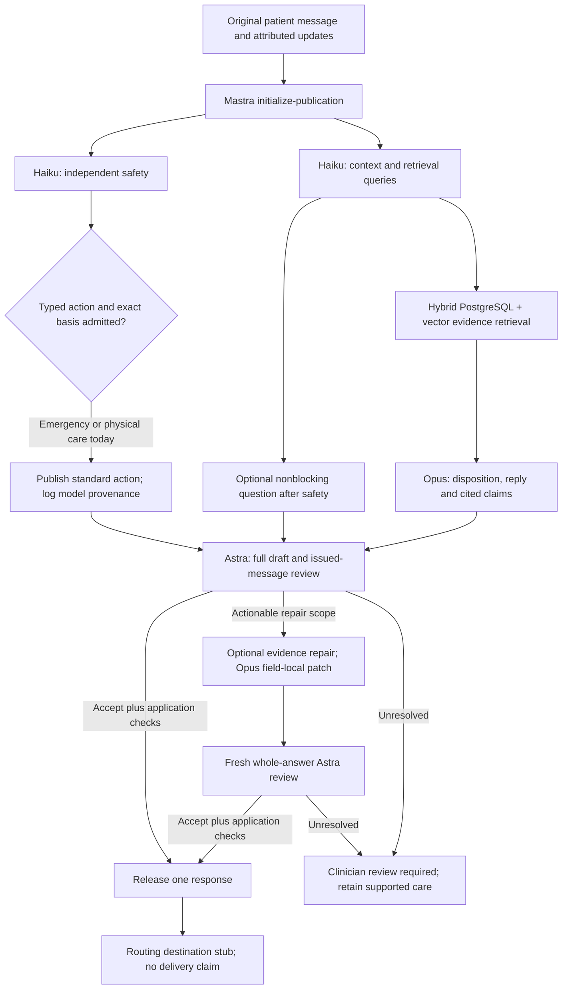

# Historical full-review candidate workflow

This is the v23 full-review design retained for comparison, not the current
default. The v25 default and its reduced guarantees are documented in
[V25_README.md](V25_README.md).

14 September 2026 · `evidence-graph/v23` · `/candidate`

Context does not see safety's proposed route. Opus receives neither CSV labels
nor the physician reference. Early advice and questions are reviewed: a correct
final route cannot erase a wrong early instruction. Four model calls without
repair, normally six with repair. One confirmed-truncation recovery per judge
invocation and one genuine failed initial generation recovery can add calls;
every attempt remains recorded.

The upgrade graph is optional **shadow-only**, after context and before retrieval;
disabled here. Retrieval is a separate layer, not another free-running agent.
Query racing or more supervisors requires measured benefit. Review, not retrieval,
was the larger bottleneck in this sprint.

## Reliability and observability

Patches bind the prior draft and current evidence hashes. Only named fields can
change; arrays replace atomically. An unchanged nominated field is logged as a
no-op rather than falsely treated as a broken repair; unrelated edits still fail.
Coupled route prose is revalidated without
forcing gratuitous rewrites. The whole answer gets a fresh judge. An old verdict
cannot approve a changed draft.

Post-cohort admission changes distinguish mechanical evidence checks from
clinical interpretation. The usual-pattern guard rejects an onset denial based
only on a usual symptom pattern; explicit onset language is marked
`not_assessed` by that guard and still requires the full exact-draft judge.
Attribution, chronology, negation and worst-ever severity are not established
by a regex. Exact patient/source quotation membership remains mandatory. The
scorecard verifies the precise recorded deferred state, rather than counting it
as a deterministic clinical pass. This state is explicitly scoped to the
candidate's full-review path; default/legacy answer checks keep their earlier
onset guard. A saved status and description cannot select the scorer's semantic
branch: the reviewed answer determines the required state. Historical policy
states require their archived implementation, not silent current regrading.
C10's redundant timing token and C36's
exact-field repair nomination were also corrected. These admission identities
are separate from the frozen cohort's measured version.

A malformed repair cannot erase an already-issued early instruction. A stronger,
independently reviewed emergency or in-person instruction can also survive a
subsequent repair failure. Server and browser verify patient, producer, patch,
source and reviewer bindings before admitting it. This carry-forward is care-only:
it never copies rejected explanation/citations or overrides a later valid adverse
care review. Cancellation cannot publish a new recommendation. An unavailable
judge cannot create a new emergency from an unreviewed draft. Care preservation
on failure is not the same as streaming that reviewed instruction before a
still-running repair finishes; the latter is not implemented.

New/corrected care-only results require provenance even when proof flags are
missing. A current async correction binds priority and task type to the exact
review; ordinary pre-repair carry remains urgent-only. Unchanged early advice can
survive without a new review, but cannot carry unreviewed explanatory content.
Explicit older graph versions retain their historical stream-reader contract.

V23 separately supports a reviewed ED-now → in-person-today alternative when
both are defensible and the final advice explicitly binds timing, necessary
capability and an access fallback. It does not require falsely calling the earlier
ED recommendation wrong. This narrow path cannot reduce an EMS activation or
active EMS continuation, and missing prerequisites block it. The browser and
offline scorer share exact-packet proof validation. A correct stronger final
recommendation can explicitly supersede an earlier under-triage without repairing
already-correct final prose. Every earlier instruction remains scored and retained.

An offline experiment replaced copied judge quotations with exact packet-local
span IDs. It improved the first selected negative packets, but failed two of four
positive-control attempts. It was **not promoted or wired into the live path**.
The quoted-anchor review remains; faster medians did not justify worse reliability.

The v8 evidence index retains 1,393 source documents but excludes two locally
quarantined MedlinePlus blood-pressure summaries from searchable chunks and
graph edges; original text is unchanged. Two scoped NHLBI sections replace that
coverage. The 5,205 eligible passages and quarantine identity are checked at
startup. Metadata/count consistency is not a full database or clinical audit.

The rapid safety role can continue explicitly reported active EMS, with exact
current-patient/current-episode evidence. Planned, cancelled, historical and
other-person activation do not qualify. A continuation retains emergency urgency.
The full safety schema remains the default; a smaller experimental schema was
not promoted after transport regressions. Unissued internal async suggestions
are not passed to Opus or graded as patient exposure; separate role-level defects
remain recorded in the [continuation report](CONTINUATION_VERIFICATION_2026-09-14.md).

Model allowance is 600 seconds, not the old 50-second cutoff. Full review has
6,144 output tokens and one 9,216-token recovery after confirmed
`finishReason=length`. These are bounded engineering settings, not clinical
response targets. Connection keepalives do not count as an answer.

Mastra spans carry topology, timing and bounded metadata. Synthetic local run
and event journals preserve exact outputs, failures, usage and sources for replay.
Transport telemetry additionally records locally observed startup, object,
finish-reason, usage and stream-end milestones, with cache counts separate from
total tokens. Historical records are not backfilled. Span and journal persistence
are reported separately. This is not HIPAA audit
certification or a production-durability claim.

[Mastra's Counsel case study](https://mastra.ai/customers/counsel-health) describes
agent orchestration and clinical tools; [Counsel's judge work](https://www.counselhealth.com/blog/scaling-clinical-quality-assurance-with-ai-judges)
motivates targeted clinical QA. This is our implementation informed by public
work—not a reproduction of Counsel's private topology or performance.
